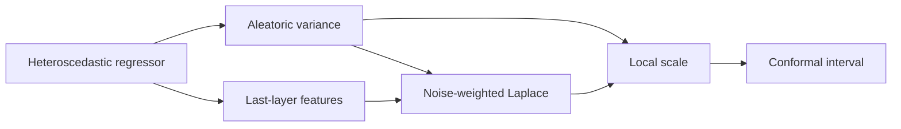

# CLAPS

**Aleatoric–Epistemic Scaling via Last-Layer Laplace for Conformal Regression**  
Official research code · Transactions on Machine Learning Research (TMLR)

[Quick start](#quick-start) · [Paper experiments](#paper-experiments) · [Reproducibility](docs/reproducibility.md) · [License](LICENSE)

CLAPS constructs a local scale for split conformal regression from a learned aleatoric variance and last-layer Laplace uncertainty. The learned variance also weights the training features in the Laplace posterior, making the second term sensitive to support in the learned representation.

## Method at a glance



## Quick start

With Python 3.10 or newer, run from the repository root:

```bash
python -m pip install -e .
python examples/basic_usage.py
```

The [small example](examples/basic_usage.py) calibrates intervals from a model's predictive mean, aleatoric variance, and last-layer features. It uses illustrative arrays; no model training or paper experiment is needed to try the API. The implementation is in [`src/claps/`](src/claps/).

## Paper experiments

The experiments are independent scripts extracted from the code used for the paper. The main studies are [weak support](experiments/01_weak_support.py) (Tables 1–2), [weighted geometry](experiments/02_weighted_geometry.py) (Table 3), [epistemic regimes](experiments/03_epistemic_regimes.py) (Figure 1), and [real-data benchmarks](experiments/04_real_data.py) (Tables 4–5). The appendix scripts cover [prior precision](experiments/05_prior_precision.py), [representation dimension](experiments/06_representation_dimension.py), [variance floor](experiments/07_variance_floor.py), and [OOD stress](experiments/08_ood_stress.py). See the [experiment-to-result mapping](docs/reproducibility.md) for the additional appendix tables and figure.

Install the experiment dependencies in an environment with PyTorch, then run any script from the repository root. For example:

```bash
python -m pip install -e '.[experiments]'
python experiments/01_weak_support.py
```

<details>
<summary>Commands for the remaining experiments</summary>

```bash
python experiments/02_weighted_geometry.py
python experiments/03_epistemic_regimes.py
python experiments/04_real_data.py
python experiments/05_prior_precision.py
python experiments/06_representation_dimension.py
python experiments/07_variance_floor.py
python experiments/08_ood_stress.py
```

</details>

The scripts retain the paper's seed counts: 30 for synthetic studies and 20 for real-data studies. Real-data runs download public benchmark datasets and require network access. Training all methods and seeds can take substantial time.

## Source and reproducibility

[`archive/claps.py`](archive/claps.py) is the unmodified Colab export used for the reported experiments. It contains multiple notebook cells and is not meant to run as one Python script. The files in [`experiments/`](experiments/) preserve those cells' experiment code; [`tools/extract_experiments.py`](tools/extract_experiments.py) checks the source hash and regenerates the standalone scripts. The reusable API was checked against the original real-data calculations on fixed inputs. Further details and the scope of those checks are in the [reproducibility notes](docs/reproducibility.md).

## License

Released under the [MIT License](LICENSE). Public datasets are fetched from their providers and retain their own terms.
